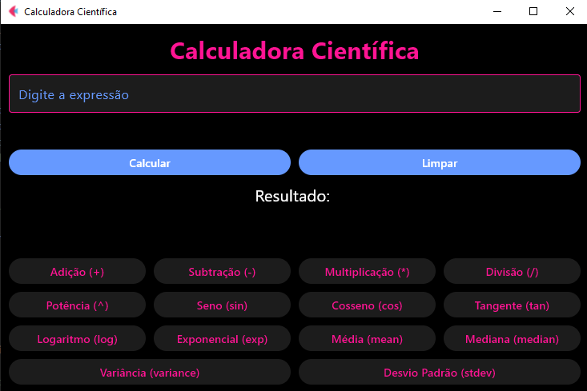

# Calculadora Científica



Este projeto é uma Calculadora Científica desenvolvida com o framework **Flet**, permitindo a realização de operações matemáticas avançadas, como potências e funções trigonométricas, além de calculos básicos como adição, subtração, multiplicação e divisão.

## Funcionalidades

- Realiza operações matemáticas básicas e avançadas.
- Suporte para funções como seno (sin), cosseno (cos), tangente (tan), logaritmo (log), exponencial (exp), média (mean), mediana (median), variância (variance) e desvio padrão (stdev).
- Interface amigável e interativa com cores vibrantes.
- Possui botão de limpar para reiniciar as operações.
- Calcula o resultado diretamente a partir da expressão fornecida.

## Tecnologias Utilizadas

- **Flet**: Framework utilizado para criar a interface gráfica.
- **Python**: Linguagem de programação usada para implementar a lógica da calculadora.

## Como Executar

1. Certifique-se de ter o Python instalado em sua máquina.
2. Instale o Flet, caso não tenha:
   ```bash
   pip install flet
