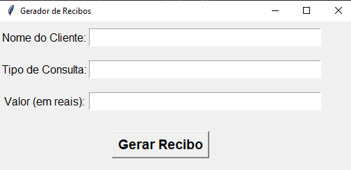
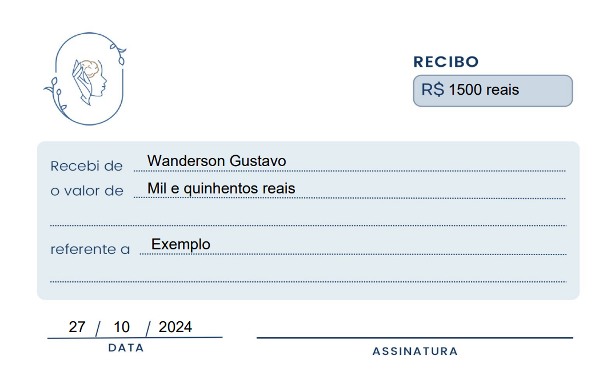

# Gerador de Recibos

Este projeto é um gerador de recibos desenvolvido em Python, utilizando a biblioteca **Tkinter** para a interface gráfica e **FPDF** para a geração de PDFs. O aplicativo permite que você insira informações do cliente, tipo de consulta e o valor, e gera um recibo em PDF com essas informações.

## Funcionalidades

- Interface gráfica simples e amigável para entrada de dados.
- Geração de recibos em formato PDF com informações do cliente e valor por extenso.
- Validação de entrada para garantir que todos os campos sejam preenchidos corretamente.
- Capacidade de salvar o recibo gerado em um local escolhido pelo usuário.

Exemplo:

## Tecnologias Utilizadas

- **Python**: Linguagem de programação principal.
- **Tkinter**: Biblioteca para criação da interface gráfica.
- **FPDF**: Biblioteca para geração de arquivos PDF.
- **num2words**: Biblioteca para converter números em palavras.
- **datetime**: Para manipulação de datas.

